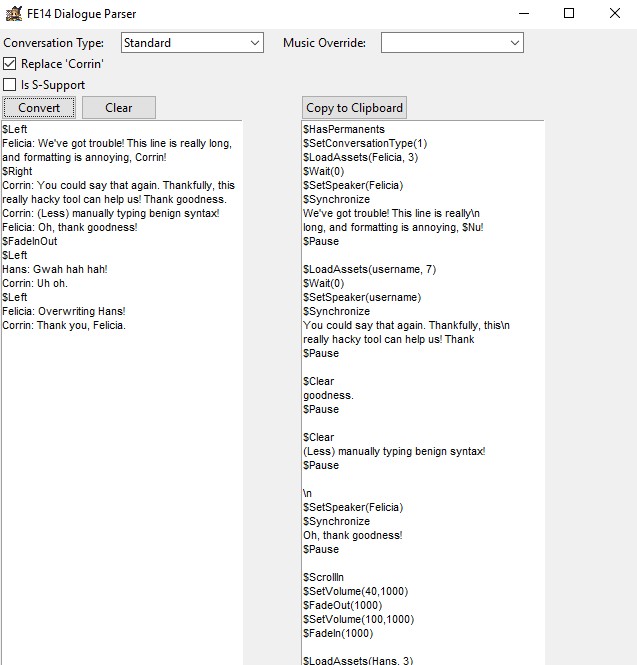

# FE14 Dialogue Parser
Simple tool for preprocessing long sets of dialogue for FE14 import. Results should be vetted by hand.

Example:

Flags:

Replace 'Corrin':

Replaces occurrences of "Corrin" with "$Nu" or "username", as appropriate.

S-Support:

Inserts the fade to white seen at the end of S-Support dialogue.

Commands:

Inserted on their own lines, not in-line with dialogue.

$Left/$Right/$Top/$Bottom - Mandatory on non-Support text, must be called before a new speaker first speaks

$FadeInOut - Inserts a short fade to black and back

$Emotions(argument) - The following speaker will use the specified emotion

$DeleteSpeaker - Deletes the previous speaker from the scene

$Panicked - The next line of dialogue will have the yelling/panicked effect on its box

$SFX(argument) - Plays the specified sound effect (placeholder text can be entered if you just want the formatting)